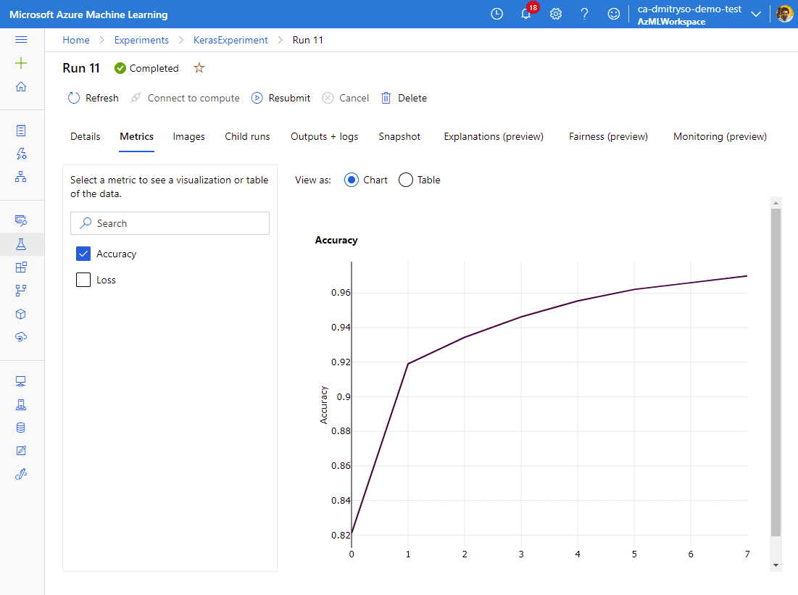

# Azure ML Workshop

## Materials for Workshops / Talks / Blog posts on Azure ML Service

Welcome!

[Azure Machine Learning](http://aka.ms/azml) is platform Machine Learning service on Microsoft Azure platform. It is intended for all kinds of users:

 * Developers not very familiar with Machine Learning can use [AutoML](https://docs.microsoft.com/azure/machine-learning/service/concept-automated-ml/?WT.mc_id=ca-github-dmitryso) or [Designer](https://docs.microsoft.com/azure/machine-learning/service/concept-designer/?WT.mc_id=ca-github-dmitryso) to develop models through the UI
 * Data Scientists can use Azure ML for enhancing their experience both when training on local compute, and on scalable compute clusters. 

Starting to use Azure ML requires getting to know some concepts. The simplest way to start using Azure ML relatively painlessly is to use Visual Studio Code.

## Creating Workspace

The simplest way to [create Azure ML Workspace](https://docs.microsoft.com/azure/machine-learning/service/how-to-manage-workspace/?WT.mc_id=ca-github-dmitryso) is manually through [Azure Portal](http://portal.azure.com/?WT.mc_id=ca-github-dmitryso). Please go ahead and create one.

You can also create a workspace through [Azure Resource Manager Template](https://docs.microsoft.com/azure/machine-learning/service/how-to-create-workspace-template/?WT.mc_id=ca-github-dmitryso) or [Azure CLI](https://docs.microsoft.com/en-us/azure/machine-learning/service/how-to-manage-workspace-cli/?WT.mc_id=ca-github-dmitryso):

```shell
az extension add -n ml -y
az group create -n myazml -l westus2
az ml workspace create -w myworkspace -g myazml
```

> **Note**: You need to have recent version of Azure CLI installed. The easiest way to do it is to pip-install using `pip install azure-cli`, or `pip install --upgrade azure-cli`.

## Using AutoML

AutoML is a service to automatically calculate the best possible algorithm that gives best results for the given set of data. It tries different combinations of algorithms from SkLearn on the data in turn, using scalable cluster resources.

1. Select **Automated ML** in the ML Portal menu.
2. Chose **New Automated ML Run**
3. In the **Select dataset** part, chose **Create Dataset -> From Open Datasets**
4. Type **MNIST** in the search box, select the dataset and click **Next**.
5. Name the dataset **MNIST**, leave all options intact and click **Create**.
6. Chose the dataset on Automated ML dialog and click **Next**
7. Enter the experiment name
8. For target column, select *Column 785*
9. For the compute cluster, chose the cluster you have created earlier. Click **Next**
10. Select **Classification** task type. Observe settings that are available under *View additional configuration settings* and *View featurization settings*.
11. When you are ready -- click **Finish**. 
12. Go to **Experiments** tab and explore the results. Automated ML takes a very long time to run through all algorithms, but you can see intermediate results.
13. On the experiment results, select **Include child runs** to see the results of all experiments.


14. Unselect **Include child runs**, click on one of the runs that took most time to execute, and select **Models** tab to observe the accuracy of individual models.


## Training Titanic Prediction Model using AutoML

1. Define Titanic Dataset:
   - Select "Tabular" as dataset type
   - Use "from the web", and specify the URL to the `titanic.csv` file in this repository
1. Explore the dataset and see which fields are available.
1. Create new AutoML Experiment with Titanic dataset
   - Select "Classification" as experiment type
   - Select "Featurization options" and leave only relevant fields. Also, you may specify field types (although AutoML does a good job figuring those out automatically)
   - Look at the other options available
   - You may select to use Deep Learning models as well
1. Submit the experiment and wait for it to complete
1. Look at the results and find the model with highest accuracy
1. You may also try to look at the interpretability of the best model and see which were the most significant features.

## Using Azure ML Designer

Azure ML designer is supposed to be a simple UI tool to create and run complex Azure ML pipelines (multi-step experiments).


1. Select the **Designer** tab on the left-hand-side menu on the ML Portal.
2. Create a new experiment using *Sample 12: Multi-Class Classification - Letter Recognition* 
3. Examine the way experiment is composed.
4. Run the experiment.
5. Monitor the results be chosing the last rectangle *Evaluate* and clicking view button on the *Outputs* tab.


## Using Azure ML From Visual Studio Code

#### Prerequisites 

1. If you do not have [Visual Studio Code](http://code.visualstudio.com) installed --- install it.
1. Install [Azure ML Extension](https://marketplace.visualstudio.com/items?itemName=ms-toolsai.vscode-ai#overview) and all other required extensions.
1. Install recent version of Azure CLI with Azure ML extension (see [documentation](https://docs.microsoft.com/azure/machine-learning/how-to-configure-cli/?WT.mc_id=ca-github-dmitryso) for details):

```bash
pip install --upgrade azure-cli
az extension add -n ml -y
az extension update -n ml
```

#### Running local MNIST Training Script 

1. Open the workshop directory (this directory) in VS Code by typing: `code .`
2. Examine `train_local.py` script. It downloads MNIST dataset from the internet, and then trains simple Scikit Learn model to classify handwritten digits.
3. Run `train_local.py` (either completely, or in Python interactive console line by line) and observe the accuracy.

#### Running training script on the cluster

4. Make sure your Azure ML Extension is connected to your cloud account and you can see your workspace in the **MACHINE LEARNING** section of Azure bar:


6. Observe `train_universal.py` script --- it is a training script that can be run both locally and submitted to Azure ML for training. Note that is almost the same as `train_local.py` --- except the code for showing digits is removed, and a few lines for logging training results are added:

```python
from azureml.core.run import Run
try:    
    run = Run.get_submitted_run()
except:
    run = None
...
if run is not None:
    run.log('accuracy', acc)
```

7. To run an experiment inside Azure ML Workspace, we need to create **compute**. **Compute** defines a computing resource which is used for training/inference. You can use your local machine, or any cloud resources. In our case, we will use AmlCompute cluster. Please create a scalable cluster of STANDARD_DS3_v2 machines, with min=0 and max=4 nodes. There are several ways to create the cluster:
   * Through web interface in [Azure ML Portal](http://ml.azure.com/?WT.mc_id=ca-github-dmitryso). Go to **Compute** section, and add new **Compute Cluster**. We suggest you follow this path if you are doing it for the first time.     
   * Through Azure CLI command:
```bash
az ml compute create -n AzMLCompute --type amlcompute --min-instances 0 --max-instances 4 
```
   * From VS Code Azure ML extension blade, go the workspace, look for **Compute** section, and click on `+` to the right of **Compute clusters** section. This will open YAML file, in which you can define the configuration of your cluster, and then submit it from VS Code environment. 
  
7. To submit `train_universal.py` to Azure ML once the cluster has been created, we need to create YAML description file. This can be done by right-clicking on `train_universal.py` file in VS Code, and selecting **Azure ML - Create Job**. This will open the editor with pre-populated YAML file, 

8. In the YAML file, you can press **Ctrl-Space** in many places to initiate auto-complete. The file defines:
    - **Script** that needs to be run
    - **Environment**, which is essentially a container that is created to perform training on a remote resource. Clicking Ctrl-Space gives you the list of predefined environments. You can also define your own, based on starting container and conda/pip environment specification. 

At the end, our YAML file should look like the following:
```yml
$schema: https://azuremlschemas.azureedge.net/latest/commandJob.schema.json
code:
  local_path: c:\demo
command: python train_universal.py
environment: azureml:AzureML-sklearn-0.24-ubuntu18.04-py37-cpu:4
compute:
  target: azureml:AzMLCompute
```

9. To submit this job to Azure ML, the easiest way is to click on the Azure ML icon in the top right corner of the YAML file editing screen. Once you have the YAML file, you can also submit it from command-line:

```bash
az ml job create -f submit-universal.yml`
```

10. One the job has been submitted, logs would be automatically streamed to VS Code terminal window. You can also observe the results in [Azure ML Portal](http://ml.azure.com/?WT.mc_id=ca-github-dmitryso). Please note that the run may take several minutes to complete. 

You now know that submitting runs to Azure ML is not complicated, and you get some goodies (like storing all statistics from your runs, models, etc.) for free.

## Using Datasets

In the current example, we have been fetching MNIST data from the Internet each time the script is run. This is not a good practice. The right solution is to define a **dataset**, or upload the data to **datastore**.

You can define a dataset in any of the following ways:
* Through the Azure ML Portal
* By uploading the data programmatically
* Implicitly, by specifying local data in the job YAML definition.

To prepare the data, run `create_dataset.py` (or `create_dataset.ipynb`). This will create a pickle file inside `datasets` directory which we will need later.

This time, let's use **Keras** to train a neural network for MNIST recognition. `train_keras.py` script contains the code, and it takes several command-line parameters. One required parameter is `data_path`, which expects the path to the folder where data is located.

We can create YAML file for job submission in the similar manner. It should look like this:

```yml
$schema: https://azuremlschemas.azureedge.net/latest/commandJob.schema.json
code:
  local_path: d:\WORK\AzureMLStarter
command: python train_keras.py --data_path {inputs.mnist}
environment: azureml:AzureML-TensorFlow-2.3-CPU:20
compute:
  target: AzMLCompute
inputs:
  mnist:
    mode: mount
    data:
      local_path: d:\WORK\AzureMLStarter\dataset\mnist.pkl       
```

Note the clever logging strategy we use in this example. We define a Keras callback object that records loss and accuracy at the end of each epoch. This allows us to see the training progress right on the Azure ML Portal, without any need for extra monitoring code.

 

Now it is easy for us to perform hyperparameter optimization by passing different arguments to the training script, and submitting multiple experiments. This can also be done programmatically, we we will outline later.

However, Azure ML allows you to define a special type of job - **sweep job**. It will automatically submit an experiment that will schedule a number of sub-experiments with distinct parameters.
## Hyperparameter Optimization

For sweep job, we need to use special YAML file. To create it, open VS Code Command Palette by pressing **F1**, and select **Azure ML: Create Job**, then choose **Sweep Job**.

You can have a look at sweep job YAML file [here](submit-keras-sweep.yml). In short, in addition to the familiar fields that we have seen previously, it also contains the definition of **parameter search space**.

Parameter search space is defined by:
 - A number of parameters, each being either drawn from a given set of values (**choice**), or from a floating point **distribution**
 - A search algorithm: greedy search, random search or bayesian search
 - An objecive - which metric should be maximized or minimized

You can also define **early termination** criteria, e.g. when metrics is not rising fast enough, we can terminate training early, without wasting computational resources.

Once you submit such an experiment, Azure ML automatically schedules a bunch of experiment runs, and offers you a convenient choice of visualizations to select the best model at the end:

 
## Experiment Submission and Hyperparameter Optimization through Python SDK

Now let's learn how to submit scripts programmatically through Python code, and how to do hyperparameter optimization:

1. Create small MNIST dataset for our experiments by running `create_dataset.ipynb` locally. It will create `dataset` subdirectory.
2. Download `config.json` file from your Azure Portal, which contains all credentials for accessing the Workspace, and place it in the current directory, or where your Jupyter notebook is.
3. Open `submit.ipynb` file in Jupyter Notebook. You can either:
    - Start a local jupyter notebook in the current directory: `jupyter notebook`
    - Upload `submit.ipynb`, `config.json` and `datasets` folder to [Azure Notebooks](http://aka.ms/aznb)
    - Create a notebook in your Azure ML Workspace (in this case you would also have to create a VM to run it on) and upload all data there.
    - Open this repository in [GitHub Codespaces](https://github.com/features/codespaces)
4. Go through all the steps in `submit.ipynb` notebook:
    - Create a reference to ML workspace
    - Create a reference to compute resource
    - Upload data to the ML workspace
    - Submit the simple experiment (please monitor the experiment on ML Portal after submission)
    - Perform Hyperparameter optimization (please see the results on ML Portal after submission)
    - Select and register the best model
5. After best model registration, you should see the model on the ML Portal under **Models** tab. Play with the options and see that you can deploy the model from the UI either as Azure Container Instance (**ACI**), or on Kubernetes cluster (**AKS**). You will need to supply the scoring Python script for that.

## Experiment Submission through ML Portal

Recently, there has been another feature added to Azure ML Portal, allowing you to submit experiments through web interface. While this is typically less convenient (because you would need to fill many forms again to re-submit), you may find it more intuitive when starting to use Azure ML.
## Train GAN Model to produce paintings

You can read in more detail about GAN Training [in my blog post](https://soshnikov.com/scienceart/creating-generative-art-using-gan-on-azureml/).


You can train the model on a number of paintings. Image above was trained on around 1000 images from [WikiArt][WikiArt], which you would need to collect yourself, for example by using [WikiArt Retriever](https://github.com/lucasdavid/wikiart), or borrowing existing collections from [WikiArt Dataset](https://github.com/cs-chan/ArtGAN/blob/master/WikiArt%20Dataset/README.md) or [GANGogh Project][GANGogh].

Place images you want to train on somewhere in `dataset` directory. After that, follow instructions in `submit_gan.ipynb` notebook.

## Cleaning up

Because using Azure ML is resource-intensive, if you are using your own Azure subscription, it is recommended to:

* Delete the compute cluster (especially because auto-scale is turned off in our demo to save on cluster preparation time), or make sure the minimum # of nodes is set to 0
* You may also delete the Azure ML Workspace and Resource group:

```shell
az ml workspace delete --w myworkspace -g myazml
az group delete -n myazml
```

Have fun!

-- [Dmitry Soshnikov](http://soshnikov.com)

[WikiArt]: https://www.wikiart.org/
[GANGogh]: https://github.com/rkjones4/GANGogh
