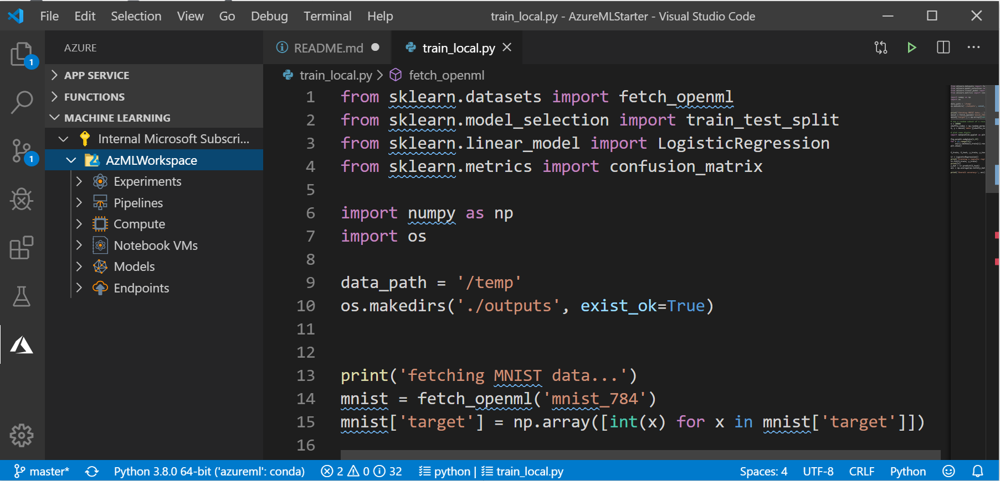
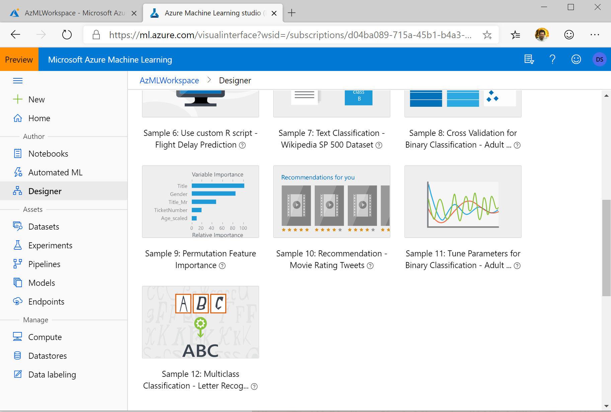
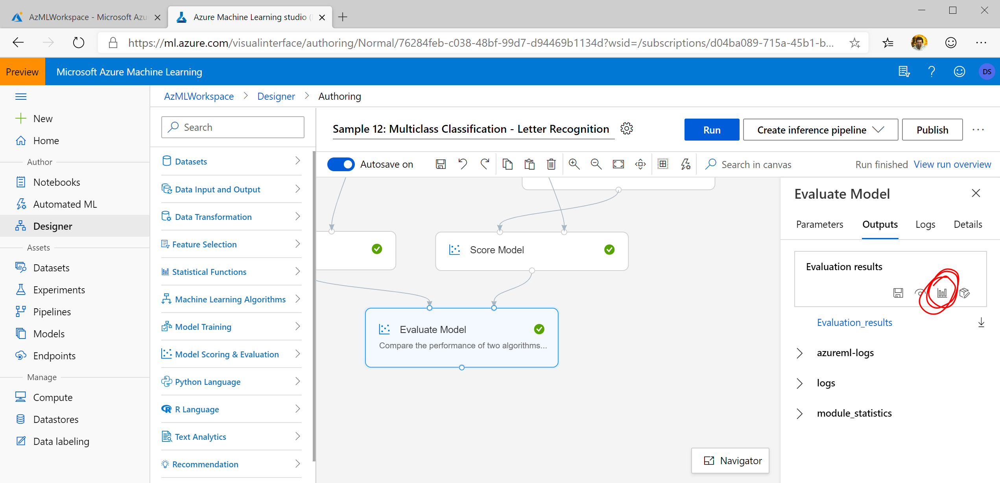
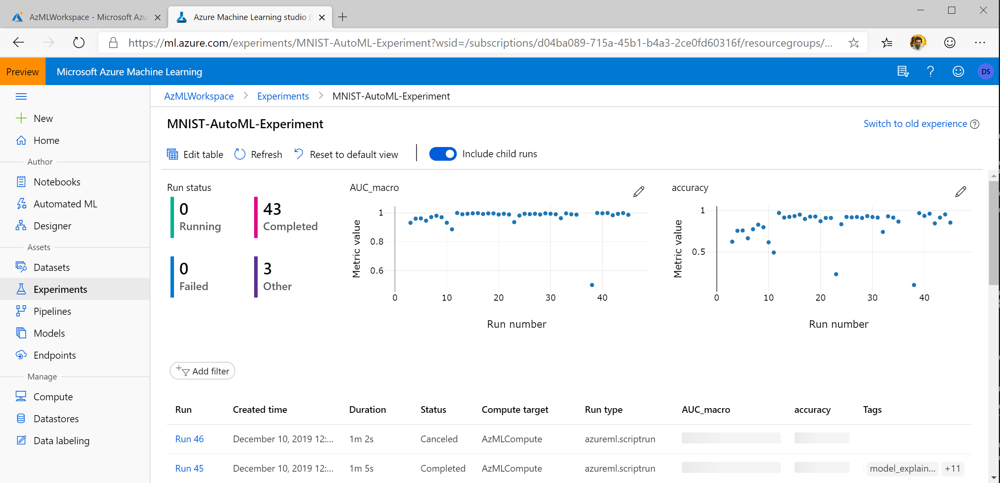
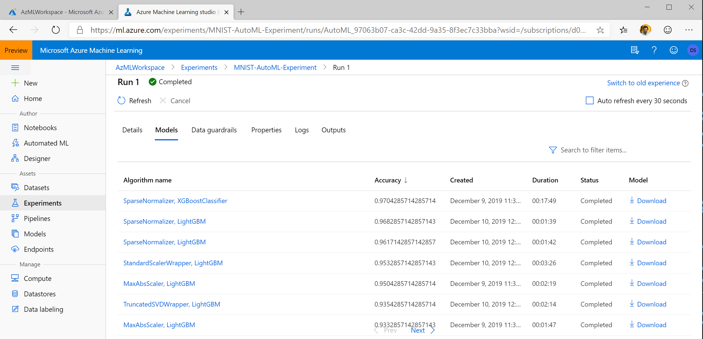

# Azure ML Workshop

## Materials for Workshops / Talks / Blog posts on Azure ML Service

Welcome!

[Azure Machine Learning](http://aka.ms/azml) is platform Machine Learning service on Microsoft Azure platform. It is intended for all kinds of users:

 * Developers not very familiar with Machine Learning can use [AutoML](https://docs.microsoft.com/azure/machine-learning/service/concept-automated-ml/?WT.mc_id=ca-github-dmitryso) or [Designer](https://docs.microsoft.com/azure/machine-learning/service/concept-designer/?WT.mc_id=ca-github-dmitryso) to develop models through the UI
 * Data Scientists can use Azure ML for enhancing their experience both when training on local compute, and on scalable compute clusters. 

Starting to use Azure ML requires getting to know some concepts. The simplest way to start using Azure ML relatively painlessly is to use Visual Studio Code.

## Creating Workspace

The simplest way to [create Azure ML Workspace](https://docs.microsoft.com/azure/machine-learning/service/how-to-manage-workspace/?WT.mc_id=ca-github-dmitryso) is manually through [Azure Portal](http://portal.azure.com/?WT.mc_id=ca-github-dmitryso). Please go ahead and create one.

You can also create a workspace through [Azure Resource Manager Template](https://docs.microsoft.com/azure/machine-learning/service/how-to-create-workspace-template/?WT.mc_id=ca-github-dmitryso) or [Azure CLI](https://docs.microsoft.com/en-us/azure/machine-learning/service/how-to-manage-workspace-cli/?WT.mc_id=ca-github-dmitryso):

```shell
az extension add -n azure-cli-ml
az group create -n myazml -l westus2
az ml workspace create -w myworkspace -g myazml
```

## Using Azure ML From Visual Studio Code

#### Prerequisites 

1. If you do not have [Visual Studio Code](http://code.visualstudio.com) installed --- install it.
2. Install [Azure ML Extension](https://marketplace.visualstudio.com/items?itemName=ms-toolsai.vscode-ai#overview) and all other required extensions.

#### Running local MNIST Training Script 

1. Open the workshop directory (this directory) in VS Code by typing: `code .`
2. Examine `train_local.py` script. It downloads MNIST dataset from the internet, and then trains simple Scikit Learn model to classify handwritten digits.
3. Run `train_local.py` (either completely, or in Python interactive console line by line) and observe the accuracy.

#### Running training script on the cluster

4. Make sure your Azure ML Extension is connected to your cloud account and you can see your workspace in the **MACHINE LEARNING** section of Azure bar:



6. Observe `train_universal.py` script --- it is a training script that can be run both locally and submitted to Azure ML for training. Note that is almost the same as `train_local.py` --- except the code for showing digits is removed, and a few lines for logging training results are added:

```python
from azureml.core.run import Run
try:    
    run = Run.get_submitted_run()
except:
    run = None
...
if run is not None:
    run.log('accuracy', acc)
```

7. Submit `train_universal.py` to Azure ML using VS Code interface and observe results in [Azure ML Portal](http://ml.azure.com/?WT.mc_id=ca-github-dmitryso). You can do so by right-clicking on `train_universal.py` and selecting **Azure ML: Run as experiment in Azure**.

During this process, you will be asked to confirm your Azure subscription, you workspace, and then to create **compute** and **compute configuration**:
  - **Compute** defines a computing resource which is used for training/inference. You can use your local machine, or any cloud resources. In our case, we will use AmlCompute cluster. Please create a scalable cluster of STANDARD_DS3_v2 machines, with min=0 and max=4 nodes. You can do that either from VS Code interface, or from [ML Portal](http://ml.azure.com/?WT.mc_id=ca-github-dmitryso).
  - **Compute Configuration** defines the options for containers which are created to perform training on a remote resource. In particular, it specifies all libraries that should be installed. In our case, select *SkLearn*, and confirm the list of libraries.

8. After you have submitted your run, observe the results on the [ML Portal](http://ml.azure.com/?WT.mc_id=ca-github-dmitryso). Please note that the run may take several minutes to complete. 

You now know that submitting runs to Azure ML is not complicated, and you get some goodies (like storing all statistics from your runs, models, etc.) for free.

## Hyperparameter Optimization

Now let's learn how to submit scripts programmatically through Python code, and how to do hyperparameter optimization:

1. Create small MNIST dataset for our experiments by running `create_dataset.ipynb` locally. It will create `dataset` subdirectory.
2. Download `config.json` file from your Azure Portal, which contains all credentials for accessing the Workspace, and place it in the current directory, or where your Jupyter notebook is.
3. Open `submit.ipynb` file in Jupyter Notebook. You can either:
    - Start a local jupyter notebook in the current directory: `jupyter notebook`
    - Upload `submit.ipynb`, `config.json` and `datasets` folder to [Azure Notebooks](http://aka.ms/aznb)
    - Create a notebook in your Azure ML Workspace (in this case you would also have to create a VM to run it on) and upload all data there.
4. Go through all the steps in `submit.py` notebook:
    - Create a reference to ML workspace
    - Create a reference to compute resource
    - Upload data to the ML workspace
    - Submit the simple experiment (please monitor the experiment on ML Portal after submission)
    - Perform Hyperparameter optimization (please see the results on ML Portal after submission)
    - Select and register the best model
5. After best model registration, you should see the model on the ML Portal under **Models** tab. Play with the options and see that you can deploy the model from the UI either as Azure Container Instance (**ACI**), or on Kubernetes cluster (**AKS**). You will need to supply the scoring Python script for that.

## Using Azure ML Designer

Azure ML designer is supposed to be a simple UI tool to create and run complex Azure ML pipelines (multi-step experiments).



1. Select the **Designer** tab on the left-hand-side menu on the ML Portal.
2. Create a new experiment using *Sample 12: Multi-Class Classification - Letter Recognition* 
3. Examine the way experiment is composed.
4. Run the experiment.
5. Monitor the results be chosing the last rectangle *Evaluate* and clicking view button on the *Outputs* tab.



## Using AutoML

AutoML is a service to automatically calculate the best possible algorithm that gives best results for the given set of data. It tries different combinations of algorithms from SkLearn on the data in turn, using scalable cluster resources.

1. Select **Automated ML** in the ML Portal menu.
2. Chose **New Automated ML Run**
3. In the **Select dataset** part, chose **Create Dataset -> From Open Datasets**
4. Type **MNIST** in the search box, select the dataset and click **Next**.
5. Name the dataset **MNIST**, leave all options intact and click **Create**.
6. Chose the dataset on Automated ML dialog and click **Next**
7. Enter the experiment name
8. For target column, select *Column 785*
9. For the compute cluster, chose the cluster you have created earlier. Click **Next**
10. Select **Classification** task type. Observe settings that are available under *View additional configuration settings* and *View featurization settings*.
11. When you are ready -- click **Finish**. 
12. Go to **Experiments** tab and explore the results. Automated ML takes a very long time to run through all algorithms, but you can see intermediate results.
13. On the experiment results, select **Include child runs** to see the results of all experiments.



14. Unselect **Include child runs**, click on one of the runs that took most time to execute, and select **Models** tab to observe the accuracy of individual models.



### Cleaning up

Because using Azure ML is resource-intensive, if you are using your own Azure subscription, it is recommended to:

* Delete the compute cluster (especially because auto-scale is turned off in our demo to save on cluster preparation time), or make sure the minimum # of nodes is set to 0
* You may also delete the Azure ML Workspace and Resource group:

```shell
az ml workspace delete --w myworkspace -g myazml
az group delete -n myazml
```

Have fun!

-- [Dmitry Soshnikov](http://soshnikov.com)